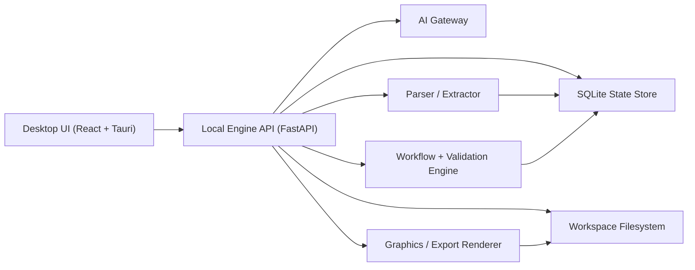

# Proposal Workbench V2 Architecture

## Status

Proposed architecture for the next version of Federal Proposal Assistant.

This design assumes we are evolving the current repository from a Claude Code skill stack into a local-first proposal application with targeted AI workflows, structured state, and a real UI.

## Executive Summary

The right v2 is not "more agentic prompts." It is a local proposal workbench with:

- a desktop UI for intake, drafting, graphics, pricing, review, and export
- a local structured state layer for proposal data and workflow progress
- deterministic workflow logic for orchestration, validation, and packaging
- targeted AI calls for extraction, planning, drafting, and review
- filesystem outputs that remain easy to inspect, version, and export

The main architecture decision is:

- **UI + workflow + validation are deterministic**
- **AI is a subsystem, not the primary runtime**

This change should improve output quality, reduce token cost, and make the tool much easier to use.

## Product Goals

### Primary goals

1. Improve proposal quality through stronger structure, evidence control, and reviewability.
2. Reduce token usage by narrowing context and caching intermediate outputs.
3. Replace chat-first operation with a purpose-built local UI.
4. Preserve the local-first privacy model and file-based deliverables.
5. Keep humans in control at every important gate.

### Secondary goals

1. Support multiple proposal types without changing prompt logic by hand.
2. Make graphics, pricing, and compliance easier to operate than they are in chat.
3. Create an architecture that can later support team workflows.

### Non-goals for v1 of the workbench

1. Multi-user real-time collaboration.
2. Browser SaaS deployment.
3. Full autonomous proposal generation with no human review.
4. Replacing Word, Excel, or PowerPoint as final review tools.

## Core Design Principles

1. **Local first.** Sensitive files stay on disk. The app works against a local workspace.
2. **Structured before generative.** Extract and store facts once; generate prose from approved facts.
3. **Human gated.** AI proposes. Humans approve, edit, reject, and route.
4. **Section-scoped generation.** Generate and review one section or artifact at a time.
5. **Deterministic orchestration.** Stage tracking, dependency checks, exports, and validation are normal software.
6. **Reproducibility.** Every AI run is versioned, logged, and tied to inputs and outputs.
7. **Dual persistence.** Database for state, filesystem for source docs and deliverables.

## Recommended Technology Stack

## Chosen stack

- **Desktop shell:** Tauri 2
- **Frontend:** React + TypeScript + Vite
- **UI state/query:** TanStack Query, TanStack Router, Zustand
- **Data grid:** AG Grid or TanStack Table for requirements/compliance workbenches
- **Editor:** TipTap or CodeMirror for section drafting and review
- **Backend sidecar:** Python 3.12 + FastAPI
- **Data validation:** Pydantic v2
- **Database:** SQLite with FTS5 enabled
- **Document parsing:** PyMuPDF for PDF, python-docx or docx2python for DOCX, openpyxl for XLSX
- **Document export:** python-docx, openpyxl, python-pptx
- **Graphics rendering:** HTML/SVG templates rendered to PNG using Playwright or headless Chromium
- **Background jobs:** App-managed SQLite-backed job queue inside the Python sidecar
- **Logging:** Structured JSON logs written locally

## Why this stack

### Why Tauri

Tauri gives us:

- desktop-grade filesystem access
- small app footprint
- local packaging and distribution
- better fit than a browser app for sensitive local workspaces

### Why a Python sidecar

The proposal pipeline is document-heavy:

- PDFs
- DOCX
- XLSX
- export packaging
- text extraction
- office rendering

Python has the best practical library story for this workload. It also makes it straightforward to build deterministic parsers, validators, and exporters.

### Why not keep this prompt-first

Prompt stacks are great for experimentation, but they are a poor control plane for:

- workflow state
- approvals
- file contracts
- sync
- audit logs
- cached intermediate outputs
- cost control

### Why not a pure web app

A browser-only app makes local filesystem interaction and secure local document workflows harder. This product benefits from behaving like a desktop workbench.

## High-Level Architecture



## Runtime Boundaries

### 1. Desktop UI

Responsible for:

- workspace selection
- intake and proposal setup
- dashboards
- data grids
- section editing
- review triage
- graphics editing
- export initiation

The UI should never directly orchestrate proposal logic. It calls the local API.

### 2. Local Engine API

Responsible for:

- proposal creation
- ingestion jobs
- extraction pipelines
- stage routing
- AI prompt assembly
- deterministic validation
- review workflows
- export compilation
- syncing DB state with files

This is the main application brain.

### 3. SQLite State Store

Responsible for:

- structured proposal data
- workflow status
- cache metadata
- AI run history
- review findings
- export records
- token accounting

This is the canonical state store for workflow and app behavior.

### 4. Workspace Filesystem

Responsible for:

- original source documents
- user-visible markdown drafts
- graphics outputs
- final Office files
- review exports

This remains the canonical artifact store for external editing and Git usage.

### 5. AI Gateway

Responsible for:

- model routing
- provider configuration
- prompt versioning
- response parsing
- caching
- token logging

The gateway must be provider-agnostic. Anthropic can be the initial default, but the architecture should support:

- Anthropic
- OpenAI
- Azure OpenAI
- Bedrock
- local models for narrow tasks later

## Canonical State Model

The app should treat the proposal as a structured object, not a folder of loosely related markdown files.

## Top-level entities

### Workspace

Represents one proposal workspace.

Key fields:

- `id`
- `slug`
- `name`
- `root_path`
- `proposal_type`
- `capture_mode`
- `customer_name`
- `agency`
- `due_date`
- `status`

### SourceDocument

Represents an imported file or text artifact.

Key fields:

- `id`
- `workspace_id`
- `kind` (`solicitation`, `customer_context`, `company_profile`, `notes`, `teammate`, `reference`)
- `file_path`
- `checksum`
- `mime_type`
- `title`
- `import_status`
- `parsed_text`
- `parser_version`

### Passage

Represents a chunk or excerpt from a source document.

Key fields:

- `id`
- `source_document_id`
- `page_or_section`
- `text`
- `anchor_label`
- `tags`

### Requirement

Represents one extracted requirement, instruction, or evaluation ask.

Key fields:

- `id`
- `workspace_id`
- `source_type`
- `source_anchor`
- `requirement_text`
- `requirement_kind` (`shall`, `volume_instruction`, `format`, `evaluation_factor`, `attachment`, `implicit`)
- `priority`
- `assigned_section_id`
- `status`

### EvaluationFactor

Represents scoring factors and subfactors.

Key fields:

- `id`
- `workspace_id`
- `name`
- `parent_id`
- `importance_rank`
- `evaluation_standard`
- `source_anchor`

### EvidenceItem

Represents an approved proof point that can be cited in drafting.

Key fields:

- `id`
- `workspace_id`
- `label`
- `evidence_type` (`past_performance`, `benchmark`, `capability`, `certification`, `customer_fact`, `pricing_assumption`)
- `summary`
- `source_document_id`
- `source_anchor`
- `approval_status`

### StrategyItem

Represents win themes, discriminators, assumptions, and risks.

Key fields:

- `id`
- `workspace_id`
- `item_type` (`win_theme`, `discriminator`, `assumption`, `risk`, `ghosting_target`)
- `title`
- `description`
- `linked_evaluation_factor_id`
- `linked_evidence_ids`
- `approval_status`

### Section

Represents a proposal section or document part.

Key fields:

- `id`
- `workspace_id`
- `section_key`
- `display_name`
- `document_group`
- `order_index`
- `status`
- `page_target`
- `required_patterns`
- `file_path`

### SectionBrief

Represents the context packet used to draft one section.

Key fields:

- `id`
- `section_id`
- `requirements_snapshot`
- `evaluation_factors_snapshot`
- `evidence_snapshot`
- `strategy_snapshot`
- `graphics_snapshot`
- `brief_version`

### DraftVersion

Represents one generated or human-edited section version.

Key fields:

- `id`
- `section_id`
- `version_number`
- `author_type` (`ai`, `human`, `mixed`)
- `content_markdown`
- `status` (`draft`, `approved`, `superseded`)
- `prompt_version`
- `derived_from_version_id`

### Graphic

Represents one proposal graphic.

Key fields:

- `id`
- `workspace_id`
- `graphic_type` (`tier_architecture`, `timeline`, `matrix`, `lifecycle`, `objectives`, `comparison`)
- `title`
- `data_json`
- `caption`
- `proof_statement`
- `html_path`
- `png_path`

### PricingModel

Represents structured pricing inputs and outputs.

Key fields:

- `id`
- `workspace_id`
- `pricing_artifact`
- `assumptions_json`
- `labor_json`
- `odc_json`
- `summary_json`
- `status`

### ReviewFinding

Represents one structured review item.

Key fields:

- `id`
- `workspace_id`
- `review_mode` (`pink`, `red`, `gold`, `white_glove`)
- `severity`
- `section_id`
- `title`
- `issue`
- `evidence`
- `recommended_fix`
- `status` (`open`, `accepted`, `resolved`, `dismissed`)

### ExportJob

Represents one packaging/export run.

Key fields:

- `id`
- `workspace_id`
- `export_type`
- `template_set`
- `status`
- `artifact_manifest_json`

### AIRun

Represents one model invocation.

Key fields:

- `id`
- `workspace_id`
- `job_type`
- `provider`
- `model`
- `prompt_version`
- `input_fingerprint`
- `output_fingerprint`
- `prompt_tokens`
- `completion_tokens`
- `latency_ms`
- `cost_estimate`

## Canonical Source of Truth

### Database is canonical for:

- workflow stage
- structured requirements
- evaluation factors
- evidence approval state
- section lists
- draft version history
- review findings
- token history
- export history

### Filesystem is canonical for:

- original imported documents
- final user-visible drafts on disk
- graphics files
- packaged exports

### Sync rule

The app owns synchronization between the DB and the workspace files.

The rule should be:

1. Imported files are read from disk and indexed into DB.
2. Drafts are edited in the UI, stored in DB, and mirrored to `drafts/*.md`.
3. External file edits are detected by file watcher and ingested back into DB.
4. Conflicts between external edits and unsaved UI edits trigger an explicit resolution prompt.

## Filesystem Contract

Keep the existing workspace shape, but make it deterministic and app-owned.

```text
proposals/<slug>/
  inputs/
    00_priority/
    01_customer/
    02_yourCompany/
    03_teammates/
    04_patterns/
    05_graphic_standards/
    06_notes/
  working/
  drafts/
  graphics/
    rendered/
  reviews/
  final/
    docx/
    xlsx/
    pptx/
    pdf/
    graphics-png/
```

The app should stop using markdown files as runtime contracts between stages. Instead:

- `working/` contains human-readable exports of structured state
- the database carries the actual machine state

## UI Information Architecture

## 1. Home / Workspace Picker

Purpose:

- create proposal workspace
- open existing workspace
- show due dates and health status

## 2. Intake Wizard

Purpose:

- choose proposal type
- set metadata
- import solicitation and supporting files
- seed company profile
- confirm output structure

Steps:

1. Proposal basics
2. Proposal type
3. File import
4. Company profile selection
5. Initial extraction run
6. Review generated setup

## 3. Proposal Dashboard

Purpose:

- show current stage
- show blockers
- show compliance status
- show draft progress
- show review status
- show token spend

Widgets:

- stage tracker
- unresolved findings
- draft completeness
- requirements coverage
- recent activity
- next recommended action

## 4. Source Library

Purpose:

- browse imported files
- view parsed text
- inspect extracted passages
- pin passages as evidence

This replaces "hope the model read the right file."

## 5. Requirements Workbench

Purpose:

- review and edit extracted requirements
- assign sections
- mark compliance status
- inspect source anchors

Key interactions:

- inline editing
- filter by source
- bulk assign section
- bulk set owner
- jump to source passage

## 6. Strategy Board

Purpose:

- approve win themes
- review discriminators
- manage assumptions and risks
- connect proof points to claims

This is the human approval gate before drafting.

## 7. Section Studio

Purpose:

- draft and revise one section at a time
- compare versions
- apply review findings

Layout:

- left panel: requirements, evidence, graphics, constraints
- center panel: draft editor
- right panel: rubric, findings, style checks

Primary actions:

- `Draft section`
- `Rewrite for clarity`
- `Add proof points`
- `Reduce repetition`
- `Respond to finding`
- `Approve version`

## 8. Graphics Studio

Purpose:

- create graphics from structured templates
- preview and edit them visually
- export HTML/SVG/PNG

Important design decision:

Graphics should be **template-driven and parametric**, not free-form AI HTML generation by default.

The system should ship with graphic schemas for:

- tier architecture
- lifecycle loop
- capability matrix
- swimlane timeline
- objectives split
- differentiator comparison

AI can propose:

- titles
- box labels
- captions
- proof statements

But layout should come from deterministic templates.

## 9. Pricing Studio

Purpose:

- gather structured assumptions
- generate the correct pricing artifact for the proposal type
- produce narrative and workbook outputs

Important design decision:

Formulas and tables should be deterministic. AI should help explain pricing and surface risk, not own the math.

## 10. Review Inbox

Purpose:

- show pink/red/gold/white glove findings in one place
- route findings back into rewrite flows
- track open vs resolved items

Primary actions:

- accept finding
- dismiss finding
- create rewrite task
- mark resolved

## 11. Export Center

Purpose:

- validate package readiness
- choose branded templates
- export docx/xlsx/pptx
- generate package manifest

## AI Architecture

## Principle

AI should operate on explicit packets, not on "the whole workspace."

## AI job types

### 1. Extraction jobs

Examples:

- requirement extraction
- evaluation factor extraction
- attachment extraction
- section/instruction extraction

Input:

- one document or one document subset

Output:

- structured JSON validated into DB

### 2. Planning jobs

Examples:

- win theme proposal
- discriminator suggestion
- section outline suggestion

Input:

- approved requirements
- approved evaluation factors
- approved evidence set

Output:

- structured suggestions for human approval

### 3. Drafting jobs

Examples:

- generate section draft
- rewrite section against a specific finding

Input:

- one SectionBrief packet

Output:

- one section draft

### 4. Review jobs

Examples:

- red-team pass
- gold-team rubric score
- unsupported-claim scan

Input:

- one or more approved section versions plus rubric packet

Output:

- structured findings

### 5. Suggestion jobs

Examples:

- next action recommendation
- likely missing proof points
- graphics recommendation

These should be cheap and narrow.

## Prompt assembly

Each job type should have:

- a versioned prompt template
- a strict output schema
- a defined input packet builder

Never hand-build large prompts from file globs at runtime.

## Model routing

Recommended initial routing:

- **small/cheap model:** classification, extraction, tagging, title generation
- **mid model:** summaries, outline generation, passage compression
- **best writing model:** section drafting, rewrite passes
- **best evaluator model:** gold-team rubric scoring

This avoids spending premium tokens on tasks that do not need them.

## Prompt caching and result reuse

Every AI run should use a fingerprint built from:

- prompt version
- model id
- input object ids
- input checksums

If the fingerprint matches a prior run, the system should offer:

- `reuse last result`
- `rerun anyway`

## Quality Architecture

## 1. Claim / Evidence Ledger

This is the single highest-value quality feature.

Every important claim in a proposal should tie back to:

- a requirement
- an evaluation factor
- an evidence item

The UI should make unsupported claims visible.

Useful checks:

- claims with no evidence
- evidence used but not cited
- duplicated claims across sections
- stale claims after evidence changes

## 2. Human approval gates

Recommended approval gates:

1. proposal setup approved
2. requirements approved
3. evaluation factors approved
4. win themes and discriminators approved
5. architecture approved
6. pricing assumptions approved
7. section draft approved
8. review findings dispositioned

## 3. Deterministic linting

Before expensive AI review, run software checks for:

- missing required sections
- unresolved placeholders
- missing attachments
- file naming mismatches
- required graphic count
- unsupported claim markers
- length overages
- heading structure issues

## 4. Structured review findings

AI review should output structured findings first:

- severity
- section
- problem
- why it hurts score
- evidence
- recommended fix

Narrative review writeups can be derived from the structured findings.

## 5. Reusable approved snippet library

Store accepted human-edited examples:

- executive summaries
- technical approach intros
- proof-point paragraphs
- action captions
- past performance narratives

Retrieve from this library during drafting based on:

- proposal type
- section type
- customer domain
- capability theme

## Token and Cost Control

## 1. Parse once, store forever

Do not re-read unchanged solicitations on every stage.

### 2. Section-scoped packets

A draft job should receive:

- only the relevant requirements
- only the relevant evaluation factors
- only the approved evidence for that section
- only the relevant style rules

Not the whole proposal.

## 3. Diff-based reruns

If one section changes, do not rerun:

- full review stack
- unrelated sections
- entire export packet

Instead, rerun only affected downstream jobs.

## 4. Low-cost helper models

Use cheaper models for:

- extraction
- tagging
- passage compression
- naming
- minor rewrites

## 5. AI run ledger

The dashboard should show:

- cost per workspace
- cost per stage
- cost per model
- most expensive job types

This is important product feedback, not just engineering telemetry.

## Key Pipelines

## Pipeline 1: Intake and Ingestion

1. Create workspace.
2. Choose proposal type.
3. Import source docs.
4. Parse source docs into text and passages.
5. Run requirement and evaluation extraction.
6. Present requirements workbench for human approval.

## Pipeline 2: Strategy Formation

1. Generate proposed win themes and discriminators from approved requirements and evidence.
2. Human reviews and edits strategy items.
3. Generate section list from proposal type manifest.
4. Build initial section briefs.

## Pipeline 3: Section Drafting

1. User opens one section.
2. SectionBrief packet is assembled.
3. AI drafts section.
4. Draft saved as DraftVersion.
5. User edits and approves.
6. Compliance status is recomputed.

## Pipeline 4: Review Loop

1. Run deterministic lint checks.
2. Run structured AI review for selected mode.
3. Save ReviewFindings.
4. User accepts or dismisses findings.
5. Rewrite tasks are created from accepted findings.
6. Affected sections are re-drafted.

## Pipeline 5: Graphics

1. User selects graphic pattern.
2. AI proposes content and proof statement.
3. User edits visual schema.
4. Renderer creates HTML/SVG/PNG.
5. Graphic is linked to sections and captions.

## Pipeline 6: Export

1. Validate readiness.
2. Select branded templates.
3. Compile approved sections.
4. Insert graphics and captions.
5. Generate Office documents.
6. Write package manifest.

## Review and Compliance Engine

The current skill stack treats review as mostly prompt behavior. In v2, review should be a combined rules + AI system.

## Compliance engine

Responsibilities:

- compare required items vs assigned sections
- compute section coverage
- mark missing or partial coverage
- generate gap list

This should be deterministic wherever possible.

## Red-team engine

Responsibilities:

- clarity
- differentiation
- proof-point presence
- duplication
- risk language

This is AI-assisted and section-aware.

## Gold-team engine

Responsibilities:

- apply rubric packet
- emit strength/weakness/deficiency findings
- tie each finding to evidence or absence

This should still be AI, but it must operate from structured rubric and section packets.

## White-glove engine

Responsibilities:

- formatting checklist
- placeholder detection
- export readiness checks

Primarily deterministic.

## Proposal Type System

Keep the proposal type registry, but move it into a formal app manifest.

Each proposal type manifest should define:

- display metadata
- stage list
- required section list
- pricing artifact
- review modes
- required graphics
- compliance sources
- page targets
- export bundle

The frontend and backend should both consume the same manifest.

This removes the current drift between:

- docs
- skills
- outputs

## Suggested Repository Layout for V2

```text
federal-proposal-assistant/
  app/
    desktop/                  # Tauri shell + frontend app
    ui/                       # Shared React UI components
  engine/
    api/                      # FastAPI routes
    domain/                   # Proposal workflows and services
    ai/                       # Prompt registry, model routing, providers
    parsers/                  # PDF/DOCX/XLSX ingestion
    renderers/                # Graphics and preview renderers
    exporters/                # DOCX/XLSX/PPTX packaging
    sync/                     # Filesystem <-> DB sync
    db/                       # SQLite models and migrations
  manifests/
    proposal-types/
    section-templates/
    review-rubrics/
    graphic-templates/
  reference/                  # Human-facing reference docs that still matter
  templates/                  # Workspace output templates
  docs/
```

## Security and Privacy

## Data handling

- keep all source files local
- store API keys in OS keychain or encrypted local config
- never send files that are not explicitly selected for AI jobs
- support workspace-level provider settings

## Auditability

Every AI run should record:

- what job ran
- what sources were included
- what prompt version was used
- what model was used
- what output was written

## Redaction mode

Later, add a per-workspace option for:

- redacted summaries only
- sanitized evidence packets
- no raw source passage upload

This will matter for higher-sensitivity environments.

## Observability

Need three local logs:

1. app log
2. sync log
3. AI run ledger

And three dashboard metrics:

1. proposal progress
2. unresolved findings
3. token spend

## Initial Delivery Slices

This is still architecture, but it is important to show a buildable shape.

## Slice 1: Foundation

Build:

- Tauri shell
- React workspace UI
- Python API sidecar
- SQLite schema
- workspace creation
- file import
- dashboard

## Slice 2: Structured Intake

Build:

- parsing pipeline
- requirement extraction
- evaluation factor extraction
- requirements workbench
- proposal type manifest consumption

## Slice 3: Section Studio

Build:

- section manifests
- section briefs
- AI draft generation
- draft versioning
- draft <-> file sync

## Slice 4: Review Inbox

Build:

- compliance engine
- red-team structured findings
- rewrite from finding
- dashboard issue tracking

## Slice 5: Graphics and Pricing

Build:

- parametric graphic templates
- pricing studio
- structured pricing artifacts

## Slice 6: Export

Build:

- branded template selection
- docx/xlsx export
- package manifest

## Key Architecture Decisions to Preserve

Keep these ideas from the current system:

- local workspace artifacts
- proposal type registry
- evaluator-first writing philosophy
- graphics as a first-class part of proposal quality
- compliance and review as explicit workflow steps

Replace these ideas:

- markdown as the primary machine contract
- chat as the main operating surface
- full-workspace prompt invocations
- skills as the main orchestration mechanism

## Open Questions

These should be resolved before implementation starts:

1. Do we want desktop-only, or desktop first with a future browser mode?
2. Is Anthropic the only initial provider, or do we want provider abstraction from day one?
3. How much external file editing do we need to support in v1?
4. Is PPTX export required for MVP, or can it follow DOCX/XLSX?
5. Do we want embedding-based retrieval in v1, or start with metadata + FTS only?

## Recommended MVP Scope

For the first build, focus on:

- intake wizard
- dashboard
- requirements workbench
- section studio
- compliance/review inbox
- docx/xlsx export

That is enough to prove the architecture and make the product materially better than the current skill stack.
